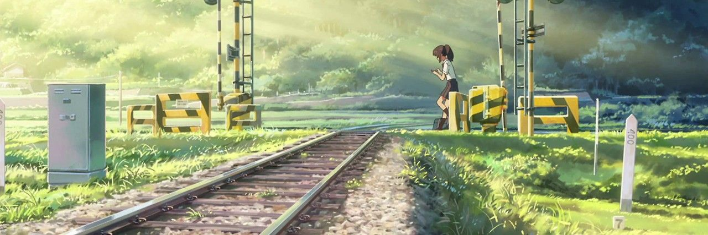

  

# Привет, меня зовут Илясов Алексей 👋

- Родился в 1975 году.
- Я живу в Подмосковье (Балашиха мкр.Железнодорожный).
- Программирую со школы (начинал с Basic 🙂)
- Изучаю JavaScript, TypeScript, React, NodeJS и сопутствующие веб технологии...
- Сейчас я работаю в КБ "Реатех".
- Увлекаюсь 3D моделированием во Fusion 360, 3D печатью и ЖД моделизмом.
- Открыт для сотрудничества в интересных проектах в качестве, бэкенд-разработчика, фронтенд-разработчика, дизайнера или разработчика.
- Связаться со мной можно по адресу <a href='mailto:ilasov.alexey@gmail.com'>ilasov.alexey@gmail.com</a> или <a href="https://t.me/wmcheck">@wmcheck</a>.

### Чего хочу!?.

Больше всего хочу участвовать в технологическом развитии: создавать алгоритмы для решения реальных задач, облегчающих работу людей, **делать что-то полезное для людей**. Люблю автоматизировать чужую работу. Не люблю, когда кто-то делает работу плохо.

### Что я не люблю делать или чего вообще не делаю:

- Ремонт, сборка и настройка компьютеров
- Настройка сетей и инфраструктуры и серверов
- Менеджмент - не очень люблю (хотя приходится), компьютером руковожу намного эффективнее

### Чем сейчас занимаюсь

Последние 3 года плотно изучаю стэк для веб разработки JavaScript, TypeScript, NodeJS, CSS, ...

Разрабатываю приложения на React и NodeJs

## Интересные(?) факты обо мне

- IQ не замерял
- не конфликтный, ответсвенный, постоянно учусь
- за последние год прочёл более 20 книг по IT
- слишком критично отношусь к своим способностям
- после травмы руки, ни как снова не заставлю себя заниматься спортом
- в школе учил немецкий, но помню только Здрасти... Досвидания... и Карандаш...
- 7 лет ходил в ансамбль "Саратовские гармошки"
- I Место в городской Юридической олимпиады среди 9-10 классов

## Трудовые будни

- [Учеба и места работы](experience.md)
- [Достижения на работе](progress.md)
- [Поощрения, сертификаты, свидетельства](promotions.md)
